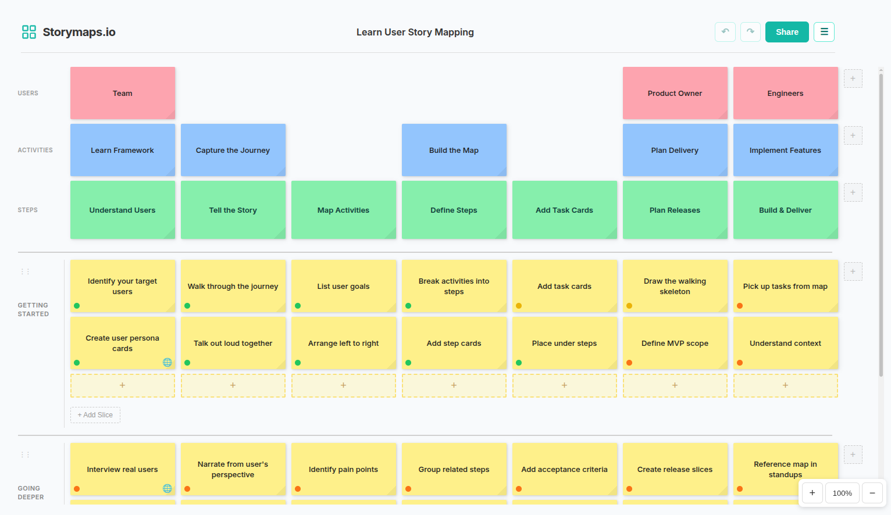

# Storymaps.io

A free, open-source user story mapping tool with real-time collaboration.



## What is User Story Mapping?

User story mapping is a technique for laying out a product as a visual map, organised around the journeys its users make. It helps teams build a shared understanding of what a product does, who it serves, how it delivers value, how it was built, and where it's going next. It's essentially a comprehension tool which shows you the product vision and evolution in a single diagram.

If a sprint shows you the tree, a story map shows you the forest.


It's not a replacement for your project management tool or your product roadmap. Your project management tool shows you the backlog, the sprint, and what work needs doing. Your roadmap tells you when things ship. But neither one shows you the product as a whole, how all that work fits together and how it's evolved. A story map is that full picture.

### Why It Matters

Agile workflows like Scrum and Kanban are great at showing you what you're building right now. They're not always great at showing you how it connects to everything else. Long-running projects often follow the same pattern: they start with energy, vision and shared understanding, and six months later that coherent picture of the product has been replaced by a giant backlog. Everyone knows what their tickets are. Nobody can point to a single place that shows how all that work fits together as a product. The vision that started the project isn't lost because people forgot it. It's lost because nothing in the workflow preserves it.

A story map preserves it. One diagram that shows who the users are, what journey they take, what features support each step, and what's been delivered versus what's planned. You can draw a line across the map and say 'everything above this is V1, everything below is V2.' The product vision stays visible, not as a document nobody reads, but as a living artifact the team works from, refers back to, and can update as the product evolves.

### Here's the basic structure of a story map:
- **Users** - Who are the users? e.g. first-time shopper
- **Activities** - What are they trying to achieve? e.g. find a product
- **Steps** - The journey they take to achieve their goals from left to right e.g. search -> browse -> compare
- **Tasks** - The work to support each step e.g. keyword search, category filters, compare products
- **Slices** - Horizontal groupings for releases (MVP, v1, v2, etc.)

## App Features

### Story Mapping
- **Users, Activities & Steps (Backbone)** - define the user journey left-to-right
- **Task cards** - break down work under each step
- **Release slices** - group tasks into MVP, V1, V2 etc.; mark slices complete or collapse them
- **Status indicators** - done, in-progress, planned, blocked with per-slice progress tracking
- **Story points** - estimate effort per card, auto-summed per slice
- **Tags** - categorize cards with free-text tags, autocomplete from existing tags
- **Legend** - define colour-coded card categories (e.g. Tasks, Notes, Questions, Edge Cases)
- **Map Partials** - reusable story map fragments that eliminate duplication when multiple user journeys converge on shared steps; extract a sequence of columns once, reference it from anywhere, and expand inline to see the detail
- **Card title & body** - each card has a short title visible on the map and an optional body for longer descriptions or details
- **Expanded view** - click the expand button on any card to edit the title and body in a larger modal; cards with body text show an expand indicator
- **Card colours & links** - 14 colours, external URLs to issue trackers
- **Drag & drop** - reorder cards, columns, and slices
- **Spacer columns** - insert spacer columns to visually group steps

### Search & Filter
- **Search** (Ctrl+F) - live search with non-matching cards dimmed
- **Filter panel** - filter by status, colour, or tag; combine multiple filters

### Multi-Select & Bulk Edit
- **Select cards** - click, Shift+click, or marquee-drag to select multiple cards
- **Selection toolbar** - bulk change colour, status, or tags; duplicate or delete selected items

### Collaboration
- **Real-time sync** - multiple users editing simultaneously (Yjs CRDTs)
- **Live cursors** - see other users' cursor positions and drag operations
- **Collaborative notepad** - shared notes that sync in real-time
- **Activity log** - real-time feed of the last 20 map edits; hover an entry to highlight the affected card on the map; CLI pushes are logged with a diff summary
- **Viewer count** - see how many people are viewing the map
- **Shareable URLs** - each map gets a unique link
- **Lock maps** - password-protect to prevent edits

### Import & Export
- **JSON** - import/export story maps as JSON files
- **YAML** - import/export as human-readable YAML; author maps in a text editor, version-control them in git, or generate from scripts
- **Jira** - export as CSV or via REST API; card body text is used as the issue description
- **Asana** - export as CSV or via REST API; card body text is used as the task notes
- **Phabricator** - export via Maniphest API; card body text is used as the task description
- **URL endpoints** - append `.json` or `.yaml` to any map URL to fetch its data programmatically (e.g. `curl storymaps.io/abc123.json`); exports include the map ID for traceability
- **Share as image** - copy map screenshot to clipboard or download as PNG
- **Print / PDF**

### Navigation
- **Infinite canvas** - Ctrl+scroll to zoom, right-click drag or touch-drag to pan
- **Pinch-to-zoom** - two-finger pinch to zoom on touch devices
- **Zoom to fit** (Alt+R / Shift+0) - auto-fit all content to viewport
- **Keyboard shortcuts** - undo/redo (Ctrl+Z / Ctrl+Y), search (Ctrl+F), duplicate (Ctrl+D), delete (Delete/Backspace), zoom, pan

### Backups
- **Manual backups** - create named snapshots of your map (up to 5 kept)
- **Auto backups** - safety snapshots created automatically before imports and restores
- **Restore** - roll back to any backup with one click; a safety backup is created first
- **Portable backups** - backups travel with JSON/YAML exports and imports; imported backups are tagged so you can tell them apart from local ones
- **Backup metadata** - each backup shows the map name, card count, size, and relative age

### Other
- **Dark mode** - matches your system theme, or toggle manually from the menu
- **Full Screen Mode** - toggle from the menu; double-Esc to exit (single Esc still closes modals, search, etc.); auto zoom-to-fit on enter and exit
- **Focus Mode** - hide card metadata (status, points, tags, links) for a cleaner presentation view; expand icons still appear on hover
- **Copy map** - duplicate an existing map to a new URL
- **Sample maps** - load examples to learn the methodology
- **Map counter** - community stat showing total maps created
- **Auto-save** - continuous save to local storage and server

## Architecture

The app is a single Node.js server (`server.js`) that handles:
- **WebSocket** - Real-time collaboration via y-websocket
- **Static files** - Serves the client app from `public/` and `src/`
- **REST API** - Lock state (`/api/lock/:mapId`), backups (`/api/backups/:mapId`), stats (`/api/stats`), and format endpoints (`/:mapId.json`, `/:mapId.yaml`)

### Data Storage
- **LevelDB** - Yjs document persistence in `data/`
- **SQLite** - Map index with names and timestamps (`data/maps.db`)
- **JSON files** - Lock state (`data/locks.json`), counters (`data/stats.json`), and backups (`data/backups/*.json`)

### Client
The client has no build step - ES modules are loaded directly from `src/`. Third-party libraries (Yjs, CodeMirror) are vendored as pre-built bundles in `public/vendor/`.

## Self-Hosting

Storymaps is a single Docker container behind a Caddy reverse proxy. It runs on any Linux server and gives your team a private instance at e.g. `storymaps.yourcompany.com` with automatic HTTPS.

### Prerequisites
- A Linux server (VM, VPS, or container platform) - 512 MB RAM / 1 vCPU is sufficient
- Docker and Docker Compose
- A domain or subdomain with DNS pointing to the server

### Quick Start

1. Clone the repo:
   ```bash
   git clone https://github.com/jackgleeson/userstorymaps.git
   cd userstorymaps
   ```
2. Edit the `Caddyfile` - replace `storymaps.io` with your domain and remove the `www` and `new` redirect blocks:
   ```
   storymaps.yourcompany.com {
       reverse_proxy app:8080
   }
   ```
3. Build and start:
   ```bash
   docker compose up -d --build
   ```
4. Visit `https://storymaps.yourcompany.com` - Caddy provisions TLS automatically via Let's Encrypt.

### Behind an Existing Reverse Proxy

If you already run nginx, Traefik, HAProxy, or another proxy, you can skip Caddy and expose the app directly.

1. Remove the `caddy` service from `docker-compose.yml` and expose port 8080 on the `app` service:
   ```yaml
   services:
     app:
       image: storymaps-app
       build: .
       restart: unless-stopped
       volumes:
         - ./data:/app/data
       ports:
         - "8080:8080"
   ```
2. Point your existing proxy at `localhost:8080` and handle TLS termination there.

   Example nginx snippet:
   ```nginx
   server {
       listen 443 ssl;
       server_name storymaps.yourcompany.com;

       ssl_certificate     /path/to/cert.pem;
       ssl_certificate_key /path/to/key.pem;

       location / {
           proxy_pass http://localhost:8080;
           proxy_http_version 1.1;
           proxy_set_header Upgrade $http_upgrade;
           proxy_set_header Connection "upgrade";
           proxy_set_header Host $host;
       }
   }
   ```
   The `Upgrade` and `Connection` headers are required for WebSocket connections.

### Data & Backups

All data lives in `./data/` on the host:
- LevelDB files - Yjs document state
- `maps.db` - SQLite map index
- `locks.json` - lock state
- `stats.json` - counters
- `backups/` - per-map backup snapshots

Back up this directory regularly (e.g. a cron job with `tar` or `rsync`). To migrate to a new server, copy `data/` across and start the containers.

### Updating

```bash
git pull && docker compose up -d --build
```

Data is preserved across rebuilds since `data/` is a host-mounted volume.

### Environment Variables

| Variable | Default | Description |
|----------|---------|-------------|
| `PORT`   | `8080`  | Server listen port |

### Running Locally (Development)

```bash
npm install
npm start
```

The server starts on `http://localhost:8080`.

## Usage
1. Visit [storymaps.io](https://storymaps.io) or self-host your own instance
2. Click **New Story Map** or try a sample to get started
3. Click **+** to add steps (columns) to the backbone
4. Click **+** in a column to add tasks
5. Click **+ Add Slice** to create release groupings
6. Click the **expand** button on a card to add a description in the body field; the title stays visible on the map
7. Click the **...** menu on cards to set colours, status, links, tags, or story points
8. Drag tasks to reorder or move between columns
9. Use the **Legend** to define card categories and colour-code your map
10. Use **Ctrl+F** to search or open the **Filter** panel to filter by status, colour, or tag
11. Click, Shift+click, or marquee-drag to select multiple cards, then use the toolbar to bulk edit
12. Use the **Notepad** to capture team notes and decisions
13. Click **Share** to copy the URL, copy the map as an image, or download as PNG
14. Use **Menu → Lock Map** to password-protect the map from edits
15. Use **Ctrl+Z** / **Ctrl+Y** to undo and redo, **Ctrl+D** to duplicate
16. Use **Ctrl+scroll** to zoom, **right-click drag** to pan, **Alt+R** to zoom to fit
17. Select consecutive columns and use **Menu → Create Partial** to extract shared sequences into reusable map partials; manage them from the **Partials** panel
18. Use **Menu → Focus Mode** to hide card metadata for a cleaner presentation view
19. Use **Menu → Full Screen Mode** for a distraction-free view; press **Esc** twice to exit
20. Use **Menu → Backups** to create, restore, or delete map snapshots
21. Use **Menu → Import** to import from JSON or YAML
22. Use **Menu → Export** to save as JSON or YAML, or export to Jira, Asana, or Phabricator
23. Use **Print** to save as PDF

## Support
If you find this tool useful, consider [buying me a coffee](https://buymeacoffee.com/jackgleeson). It goes towards server costs and helps me keep the app running.

## Credits
- Thanks to Jeff Patton for pioneering user story mapping. Learn more: [Jeff Patton's Story Mapping](https://jpattonassociates.com/story-mapping/)
- Real-time collaboration powered by [Yjs](https://yjs.dev/) CRDTs
- Drag and drop powered by [SortableJS](https://sortablejs.github.io/Sortable/)
- Collaborative notepad powered by [CodeMirror 6](https://codemirror.net/)

## License
AGPL-3.0 - see [LICENCE](LICENCE) for details.
